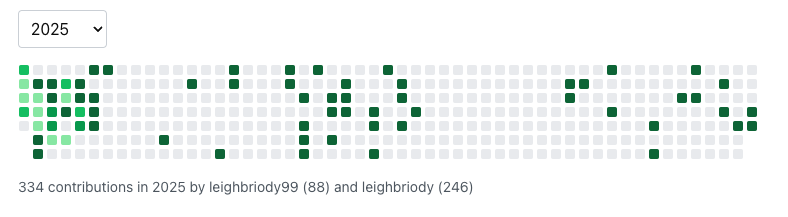

# 📊 GitHub Contributions Widget

A React component that displays GitHub contributions from multiple accounts in a unified heatmap visualization, similar to GitHub's contribution graph but with support for merging contribution data from multiple GitHub accounts. 🔄 ✨

## 📸 Screenshot



## 📦 Installation

```shell
npm i react-github-activity-grid
```

## 🚀 Usage

```tsx
import { GithubContributionsWidget } from "react-github-activity-grid";

<GithubContributionsWidget
    usernames={["joebloggs","marybloggs"]}
    githubApiKey={<your github account api key>}
/>;
```
💡 Learn more in this GitHub discussion: [here](https://github.com/orgs/community/discussions/24812).

## 🤝 Contribute

This is an open-source project! 🎉 Feel free to explore, report issues, or contribute enhancements on GitHub:
[react-github-activity-grid](https://github.com/leighbriody/react-github-activity-grid)

## 🌟 Potential Future Releases

Here are some exciting updates planned for future versions of the widget:

📊 Advanced Stats: Display enhanced statistics, such as contribution streaks, most active days, and more.
🗓️ Conditional Text Display: Optionally display text-based information, such as specific days and months, alongside the graph.
🎨 Customizable Styles: Expose styling options to allow users to modify the widget's appearance externally.
🔒 Private Repo Support: Explore solutions to incorporate contributions from private repositories.
🖱️ Improved Interactivity: Add interactive features, such as clickable links to specific contributions.
